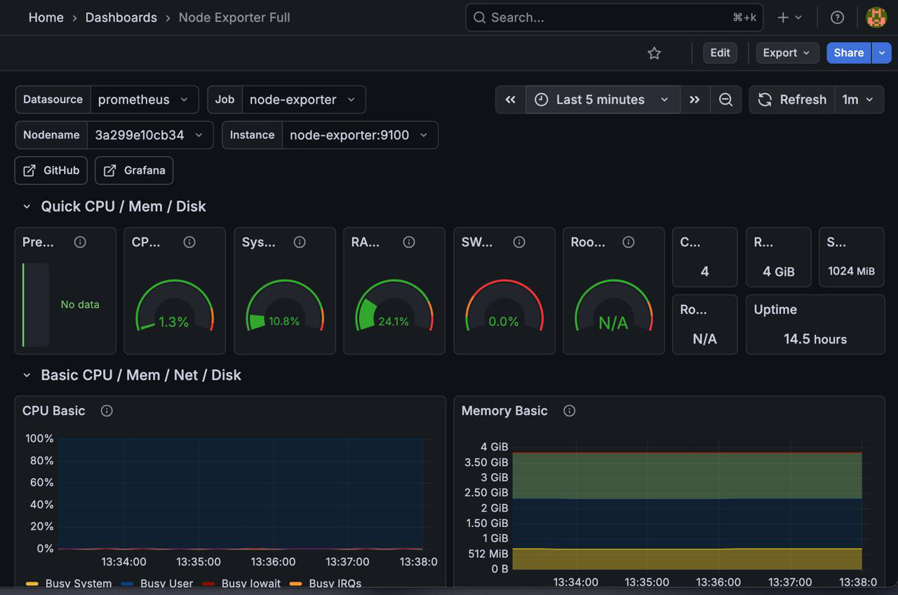

# Production Server Monitoring Stack 🚀



## 📋 Overview
A fully containerized monitoring solution for Linux Infrastructure using **Prometheus**, **Grafana**, and **Node Exporter**. 

## 🛠 Features
- **Real-Time Monitoring:** CPU, RAM, Disk I/O, and Network Traffic.
- **Dockerized:** Deploys in under 30 seconds on any Linux server (Ubuntu/CentOS/Amazon Linux).
- **Data Retention:** Persistent storage for historical metrics.

## 🚀 Quick Start
```bash
docker-compose up -d
```

## 🔧 Tech Stack
- **Prometheus:** Metrics Collection
- **Grafana:** Visualization & Alerting
- **Node Exporter:** Hardware Metrics
